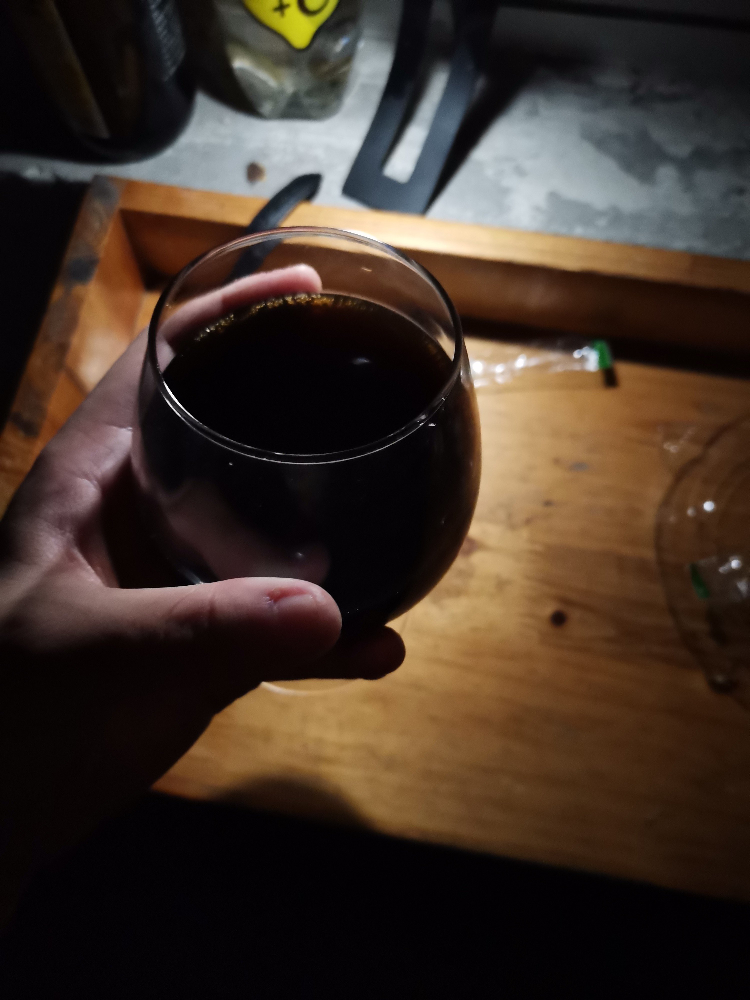

Title:     【天欲雪】精酿入门之世涛初体验
Date:   2020-6-10

[TOC]

这款真的很香

可以说是我目前喝过的最好喝的啤酒，起初我还怀疑我会不会接受不了世涛的味道，实际上，习惯了咖啡的我，世涛的苦度对我来说就是小意思。苦真是一种有深度的味道，我不太喜欢甜，比如我这周喝的芙力荔枝和同样的迷失海岸的草莓啤酒，这两款我都觉得好汽水，但是好喝确实比一般汽水好喝一点。

这款世涛是我喝的第一款瓶世涛，为什么选择迷失海岸的这款呢也是因为经济比较拮据，买不起打嗝海狸的，只好退而求其次了。不过感受到了世涛的风味，我是彻底爱上这个风格了。

## 色 | Look

我的酒杯很少，只有两个白兰地杯和皮尔森杯，世涛很适合用白兰地杯，一瓶可以把一个中号的白兰地杯装的满满的。迷失海岸这款世涛气泡比较少，也有可能是天气的缘故，有薄薄的一层气泡浮上来，不过很快就消失了。所以挂壁和蕾丝啥的，也不用欣赏啦。

通体棕黑色，可以看一看我在夜里低光下拍的照片。不透明，因为加了花生酱，所以如果轻微摇晃，其实是有一种粘稠感和凝滞感的，不过比较微弱。

## 香 | Smell

白兰地杯起到了很好的收敛香气的作用，其实我刚开瓶的时候就迫不及待的吸了一口，倒在杯子里仔细闻了一闻。最浓最浓的是烘烤过的麦芽发酵后产生的咖啡+巧克力的味道，隐隐约约夹杂着一种烘烤物的焦香，类似于核桃，栗子等等... 花生酱的味道隐藏地比较深，但是喝的时候会比较体现的出来。

## 味 | Flavor

说起世涛，世涛最明显的味道便是苦。不过也正是得益于苦，给他带来了非常丰富的香味。刚入口的时候可以感觉到一丝丝的甜味，随后大量啤酒花带来的苦味横冲直撞，一阵苦味过去之后，各种香气升腾而起，你的鼻腔中碰撞，缠绵悱恻，让你欲罢不能...

## 总体评价

好喝！让我对世涛这种类型产生了兴趣！因为之前喝的最多的是德式小麦，怕自己接受不了这么重口味的啤酒。不愧是RateBeer上常常霸占前十席绝大部分的类别，算是知道了一部分答案。

----

世涛的英文名称是stout，除了一般的stout以外还有double stout和imperial stout，这两种均在stout的基础上加大了啤酒花的投入，一言以蔽之，口味更重了。应该会好喝！
