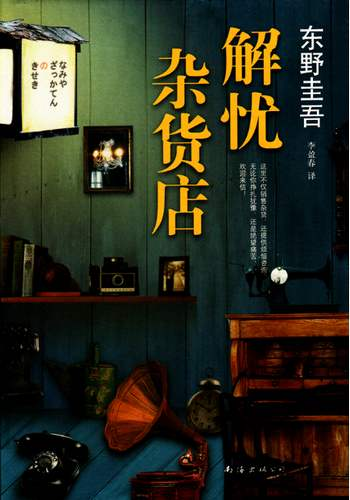

Title:  【始知道】二周目の《解忧杂货店》
Date:   2020-06-01

> **地图是一张白纸，这当然很伤脑筋。任何人都会不知所措。 可是换个角度来看，正因为是一张白纸，才可以随心所欲地描绘地图。**

其实，第一次读这本书，是在高一第一个学期的期末考试前夕。因为复习太无聊了，在图书角发现了这本书，那应该是在2018年1月份左右。那时候我还不知道东野圭吾这个作家，所以这本书也是我接触东野圭吾的第一本。

翻了几页，便一番不可收拾。发现这本小说有特别吸引人的地方。对于当时的我来说，就是看似没有联系的一些人，却又无形之中联系到了一起。看似遭受的是与他人无关的痛苦，实际上可能是他人的救赎。可以解决任何烦恼的杂货店是几个命运不算顺利的人的命运的交汇点。让我感受到，人与人之间是存在着温暖的，尽管常常因为生活中的疾苦而无法感受到，但请君坚信吧，生活并不是总是一味的疾苦，所以努力的生活下去吧！

那是我对这本小说最初的感想。如今我重拾这本书，可能因为经历的事情变多了的缘故，再次翻阅这本小说便有了全然不同的解读。

我最喜欢的故事是松岗克朗的故事。松岗克朗是一个怎样的人呢？我想他首先一定是一个年轻人，一个和我一样的人。他最后没有实现自己的音乐梦，可以说是他是抱着理想溺死的命运的悲剧者。但是他的悲剧并非没有意义，正是他的悲剧，才有他人的《重生》。这样，从某种方面说，他又是当之无愧的成功者。

> 但有一点我想告诉你。 你对音乐的执着追求，绝不是白白付出。 我相信，将会有人因为你的歌而得到救赎。你创作的音乐也必将流传下去。 若要问我为何能如此断言，我也很难回答，但这的确是事实。 请你始终坚信这一点，坚信到生命最后一刻。

抛开一切不管，追寻梦想的勇气是放弃的勇气。社会会毫不留情地把你想见的、你不想见的所有事实毫无保留地呈现在你面前。追寻梦想的勇气是妥协的勇气，每个人都幻想成功，但谁愿意笑着面对失败？面对失败，是否每个人都有退而求其次的勇气和理智？面对着没有结果的理想，你是否只是将自己安排在道德的至高处给自己以安慰？还是选择退而结网，转而寻求别的理想吗？如果这样做，你会认为所谓的理想，不过只是如此不堪一击的东西吗？

面对烦恼，你必须要有学会放弃的勇气。这是我第二次读这本小说时的解读。有勇气放弃，意味着有勇气选择。只有做出了选择，并且坚定的走下去，虽然结果并不会如愿，但至少地，不会让自己陷入迷茫的泥淖和无尽的痛苦。

这是这本书给我的最大感触，做出选择，意味着放弃。人都是贪婪的，理想的，但是生活是现实的。临渊羡鱼，不如退而结网。我想，学会这一点，还需要许多打磨吧。