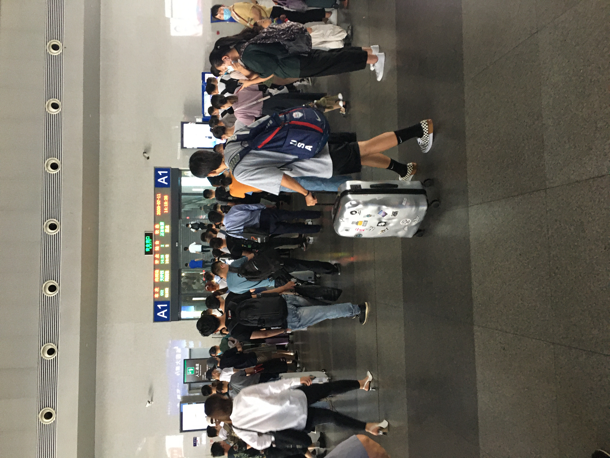
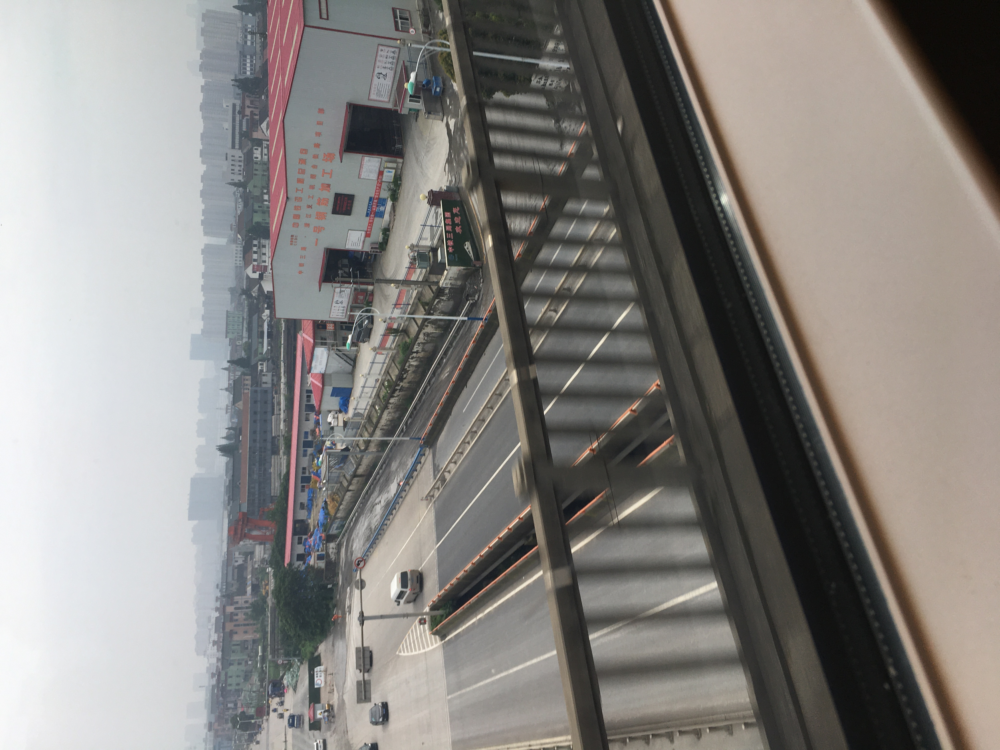

# 杭州行

## 写在前面

对于杭州，我在2019年的冬天来过一次。那次是真的来旅游的，去了浙江省博物馆的孤山馆区，看到了木乃伊。可惜的是绝大多数当时拍的照片都遗失了（手机被我扔河里面去了），然后flyme的照片同步同步的好烂.. 无力吐槽。 不过现在有iCloud同步确实很爽，每个月6块钱有50g的云空间。

言归正传，这一次来杭州又有了不一样的心境。高考告终，紧接的就是三位一体的面试。10号下午和11号上午在家小憩一下，中午就得到绍兴北站坐高铁去杭州。面试会在12号上午开始。

## 绍兴北站

这是我第几次来绍兴北站呢？就我有意识以来说，这是我第二次来绍兴北站。第一次来绍兴北站是和同学去逛漫展，不过就算是那次也只是在市内，这次不但是自己孤身一人，而且是前往一个陌生的城市。嘛，有点小紧张呢！

由于疫情的缘故，绍兴北站里面的检测很严格。

炫酷的复兴号，第一次见到高铁本铁(

### 黄色地标

说说一个坐高铁的小插曲。因为我的车厢是5号车厢，而我根本不知道如何去5号车厢！地上好像有一些奇妙的符号（后来得知叫做地标）。我像个没头苍蝇一样跟着人群往前走，看到他们都找到了自己的车厢颇感慌乱，我前面一个大妈好像和我同病相怜，询问了一个路人之后才得知，原来是看黄色地标！这样我才知道地标是怎么回事，才在高铁进站之前匆忙赶到了自己的车厢。后来这位大妈又和我在杭州相遇。直到出了杭州东站才就此别过。

-------

## 奔跑的复兴号

高铁真是又稳又快，怪不得~~古人~~言:

> 中国高铁，快出天际

高铁经过一段时间的加速，跨上立交桥。山川湖海在身边的窗子慢慢地铺排开来。一眨眼，就走过了一座连绵的小山丘，我可惜不能想公交车一样仔细端详山腰上的小树；一转眼，又过了一座桥，水上的乌篷船就像漂浮在水上的一片树叶；突然，列车钻进了隧道，服务员用温柔的声音播报到，啊，原来已经快要到杭州东了！我不敢相信似地望桥下正在行驶的车辆一看，哦！原来他们的车牌上的清一色浙D，已经变成了浙A，浙C，浙D... 
是的，比起绍兴，杭州是一个接纳更多多元化的城市。

乘客开始骚动，因为快要下车了。这时有一位乘客高兴地叫到，钱塘江！原来脚下已经不再是公路，而是滚滚的钱江水。我想起来杭州在古时候也叫做钱塘呢。这时候我相信，我应该是到杭州了。

-------

## 前往地表

到达杭州东，旅途仍未结束。勇士的目标可是星辰大海啊！

杭州东站的复杂程度远出绍兴北站之右，根据我的路线，我要先去坐地铁一号线才是。

地铁！我知道地铁在早高峰是一个拼体力的地方。不过我到的时候已经在下午。在杭州东站摸了半天，终于买到了地铁票。（地铁售票机只接受纸币，这会让人很苦恼啊。）

### 地铁一号线的反复横跳

杭州地铁一号线确实把我坐蒙圈了。

首先这条地铁一号线号称是去下沙/江滨的，但是实际上有两条路线。看图吧

(配图)

我上车之前没有仔细考虑过这个抗体形状的线路究竟是咋回事，径直上车，上车之后望着上面的灯仔细考虑了一下，发现我想去的那条路一直是灰色的，我暗道一声，吗的！我不会坐错了吧，下意识以为自己坐反了，如果深入另一条路原路返回可能会遇上麻烦，于是我毅然决然在九堡下车了。后来看了车站的灯，才意识到原来一号线的车会间隔在两条路线中间反复横跳，第一次是走一条路，那么下一次就是另一条路。不过还好地铁的更新速度很快，很快我就上了正确的车。

### 我想出去

下车之后又遇上一个小麻烦。因为出站需要刷卡or刷码。而可以刷的卡我一张也没有，我也不知道扫什么码。因为根本就没说清楚啊！支付宝扫码这个也太广泛了吧！我哪里知道是什么码！后来尝试了几个最有可能的码之后我放弃了。发现那里有个插卡口，我试探性地将我的单程地铁票插了进去看看，噢！果然开门了！

（所以地铁票丢了的话，会被困在车站吧！想想都可怕）

经过一番挣扎以后，爷终于到达地表了！oh！杭州的天空！杭州的水泥地面！杭州的人行道！杭州的.... 行啦，还有酒店要去呢。

-------

## 杭州的夜

在房里待到晚上五点多，已然饿的不行，准备出去走走，先去明天要面试的学校看看吧！

(配图)

不知道附近有啥吃的，就看了附近评价高的炸鸡店。看起来非常不错，店主是一个有点口音的阿姨，非常和蔼可亲的感觉。

隔壁桌是两个刚刚毕业的应届生(大学生)。我虽然没有和他们攀谈，但是也只有这一类的特殊人群，谈话中既有学校和学业，又有工资和就业。既有年轻人的棱角，又感觉初步体现出社会打磨的光泽。嘛，童子不知，姑且猜测吧。

（配图，杭州夜，科技园路）

## 写在最后

很美呢，杭州！

